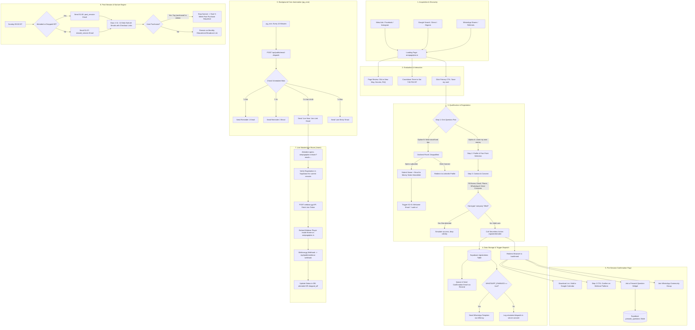
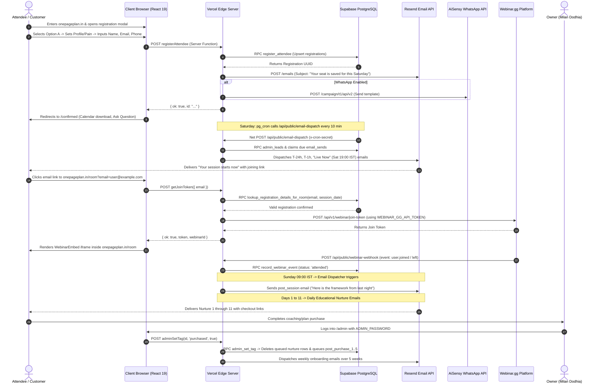
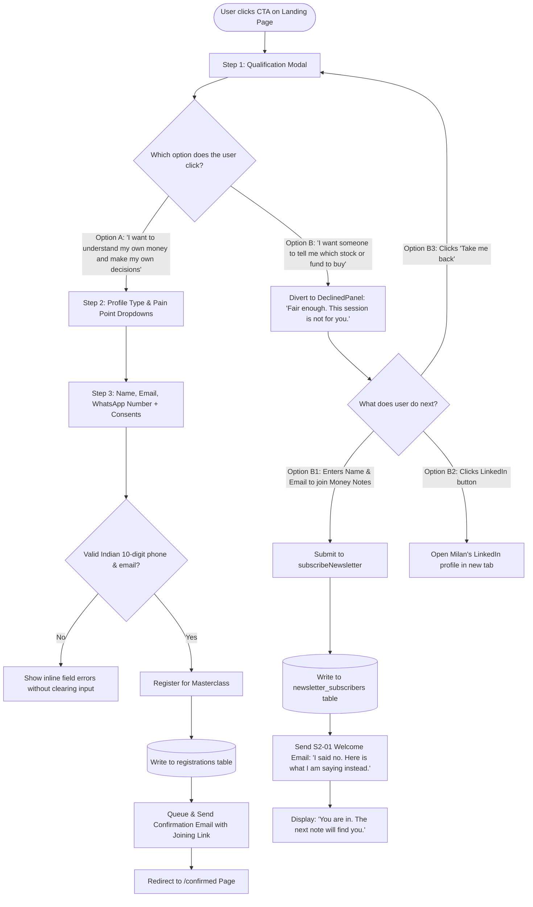

# One Page Plan — End-to-End System Workflow, Architecture & Security Audit

> **Document Version:** 1.0.0  
> **Target Project:** `onepageplan.in` (The Money Reality Masterclass)  
> **File Purpose:** Single comprehensive source of truth covering the complete customer journey, all movable system parts, image dispatch audit, chronological sequence, owner update requirements, and security vulnerabilities / API key exposures.

---

## Table of Contents

1. [Executive Summary](#1-executive-summary)
2. [End-to-End Visual Workflow Flowcharts](#2-end-to-end-visual-workflow-flowcharts)
   - [2.1 High-Level Customer Journey Flow](#21-high-level-customer-journey-flow)
   - [2.2 Detailed Sequence Diagram (Landing to Post-Purchase)](#22-detailed-sequence-diagram-landing-to-post-purchase)
   - [2.3 Decision Tree: Option A (Masterclass) vs Option B (Newsletter)](#23-decision-tree-option-a-masterclass-vs-option-b-newsletter)
3. [Movable Parts & System Architecture](#3-movable-parts--system-architecture)
   - [3.1 Architectural Component Map](#31-architectural-component-map)
   - [3.2 Infrastructure & Services Breakdown](#32-infrastructure--services-breakdown)
   - [3.3 Database Tables & RPC Security Model](#33-database-tables--rpc-security-model)
4. [Images Being Sent & Handled (Complete Image Audit)](#4-images-being-sent--handled-complete-image-audit)
   - [4.1 Outgoing Emails: Zero-Image Architecture](#41-outgoing-emails-zero-image-architecture)
   - [4.2 WhatsApp Dispatches](#42-whatsapp-dispatches)
   - [4.3 Web App & Asset Inventory](#43-web-app--asset-inventory)
5. [The Sequence: Step-by-Step Lifecycle Timeline](#5-the-sequence-step-by-step-lifecycle-timeline)
   - [5.1 Pre-Session Timeline (Registration -> T-0)](#51-pre-session-timeline-registration---t-0)
   - [5.2 Live Session Room Timeline (Saturday 18:30 -> 21:00 IST)](#52-live-session-room-timeline-saturday-1830---2100-ist)
   - [5.3 Post-Session & 11-Day Nurture Timeline (Sunday -> Day 11)](#53-post-session--11-day-nurture-timeline-sunday---day-11)
   - [5.4 Paid Customer Lifecycle (Post-Purchase Onboarding)](#54-paid-customer-lifecycle-post-purchase-onboarding)
6. [Owner Operations: What You Have to Update & Maintain](#6-owner-operations-what-you-have-to-update--maintain)
   - [6.1 Mandatory Initial Setup Checklist](#61-mandatory-initial-setup-checklist)
   - [6.2 Weekly & Routine Owner Tasks](#62-weekly--routine-owner-tasks)
   - [6.3 Environment Variables Reference Table](#63-environment-variables-reference-table)
7. [Security Audit & Identified Risks (Open API Keys & Vulnerabilities)](#7-security-audit--identified-risks-open-api-keys--vulnerabilities)
   - [7.1 Critical Security Vulnerabilities](#71-critical-security-vulnerabilities)
   - [7.2 Exposed / Open API Keys & Secrets](#72-exposed--open-api-keys--secrets)
   - [7.3 Medium & Low Severity Risks](#73-medium--low-severity-risks)
   - [7.4 Immediate Remediation Action Plan](#74-immediate-remediation-action-plan)

---

## 1. Executive Summary

`onepageplan.in` is a high-conversion, editorial financial education funnel designed for Indian salaried professionals and practice owners aged 30–45. It runs the **Money Reality Masterclass**, a free live 90-minute session held every Saturday at 7:00 PM IST by Milan Dodhia (Financial Educator, operated under Mannrs Wellness LLP).

### Funnel Highlights:
- **Zero-hype "Sage" aesthetic:** Cream paper (`#FAF7F0`), deep olive (`#4A5A3A`), aged brass (`#B8873B`), Bricolage Grotesque & IBM Plex Sans typography.
- **Strict compliance constraints:** No investment advice, no stock tips, no fund recommendations, no fake scarcity, no struck-through prices.
- **Automated multi-channel lifecycle:** Dual-branch qualification popup, serverless database upserts via Supabase, scheduled email sequences via Resend & `pg_cron`, WhatsApp reminders via AiSensy, custom in-page webinar iframe embedding via Webinar.gg, and post-session nurture leading to paid 1-on-1 coaching / memberships.

---

## 2. End-to-End Visual Workflow Flowcharts

### 2.1 High-Level Customer Journey Flow



---

### 2.2 Detailed Sequence Diagram (Landing to Post-Purchase)



---

### 2.3 Decision Tree: Option A (Masterclass) vs Option B (Newsletter)



---

## 3. Movable Parts & System Architecture

### 3.1 Architectural Component Map

```
┌────────────────────────────────────────────────────────────────────────────────────────┐
│                                   CLIENT LAYER (Browser)                                │
│                                                                                        │
│   Landing Page (/)   ───►   Confirmed (/confirmed)   ───►   Live Room (/room)          │
│   - Countdown IST          - Calendar .ics download        - Direct Token Check        │
│   - Dual-Choice Modal      - Prework Q&A Submission        - Embedded Iframe Player    │
│   - Hotjar + Meta Pixel    - WhatsApp Community CTA        - Analytics (JoinedRoom)    │
│                                                                                        │
│                                Admin Console (/admin)                                  │
│   - Real-time Lead CRM     - Tag Management ('purchased', 'hot', 'attended')           │
│   - Email Queue Monitor    - Dynamic Template Editor & Broadcast Links                 │
└───────────────────────────────────────────┬────────────────────────────────────────────┘
                                            │ HTTPS / Server Functions
┌───────────────────────────────────────────▼────────────────────────────────────────────┐
│                             SERVERLESS APPLICATION (Vercel)                            │
│                                                                                        │
│   TanStack Start / Nitro Engine (Node.js & Edge Runtime)                               │
│   ├── Server Functions (RPC callers via Supabase Public Server Client)                │
│   │   ├── registerAttendee()          submitPreworkQuestion()                         │
│   │   ├── getJoinToken()              adminDashboard() / adminSetTag()                │
│   │   └── subscribeNewsletter()       adminSendEmails()                               │
│   └── Public API Endpoints                                                             │
│       ├── /api/public/email-dispatch   (Triggered by pg_cron / external secret)       │
│       ├── /api/public/resend-webhook   (Svix signature verified delivery tracker)      │
│       ├── /api/public/webinar-webhook  (Webinar.gg attendance/dropoff events)          │
│       └── /api/get-webinar-token       (Legacy proxy endpoint)                         │
└───────────────────────┬───────────────────────────────────┬────────────────────────────┘
                        │                                   │
┌───────────────────────▼───────────────┐   ┌───────────────▼────────────────────────────┐
│          DATABASE (Supabase)          │   │           EXTERNAL THIRD PARTIES           │
│                                       │   │                                            │
│   PostgreSQL 15+ Engine               │   │   Resend API                               │
│   ├── Tables:                         │   │   - Transactional & Nurture emails         │
│   │   ├── registrations               │   │   - Svix webhook notifications             │
│   │   ├── email_sends (queue & log)   │   ├────────────────────────────────────────────┤
│   │   ├── email_settings              │   │   Webinar.gg API                           │
│   │   ├── email_template_overrides    │   │   - Join token generation via REST API     │
│   │   ├── lead_tags                   │   │   - Embedded live session stream           │
│   │   ├── newsletter_subscribers      │   ├────────────────────────────────────────────┤
│   │   ├── prework_questions           │   │   AiSensy (Meta WhatsApp Business API)     │
│   │   └── app_config                  │   │   - Template message dispatches            │
│   ├── Extensions:                     │   ├────────────────────────────────────────────┤
│   │   ├── pg_cron (10-min dispatcher) │   │   Analytics & Tracking                     │
│   │   └── pg_net (async HTTP POST)    │   │   - Meta Pixel (Facebook Ads)              │
│   └── Security Model:                 │   │   - Hotjar (Session Heatmaps)              │
│       └── SECURITY DEFINER Functions  │   │   - OpenAI Pixel                           │
└───────────────────────────────────────┘   └────────────────────────────────────────────┘
```

---

### 3.2 Infrastructure & Services Breakdown

| Component / Service | Technology / Provider | Purpose & Responsibilities | Key Config Variables |
|---|---|---|---|
| **Web Frontend** | React 19, TanStack Router, Tailwind CSS v4 | Renders responsive landing page, modals, countdown timer, room player, and admin console. | `VITE_SUPABASE_URL`, `VITE_SUPABASE_PUBLISHABLE_KEY` |
| **Server Engine** | TanStack Start on Vercel | Executes server functions, API endpoints, rate limiting, and webhook verification. | `ADMIN_PASSWORD`, `WEBHOOK_SHARED_SECRET`, `RESEND_WEBHOOK_SECRET` |
| **Database & Auth** | Supabase (PostgreSQL 15) | Single source of truth for registrations, email logs, settings, and questions. Enforces strict RLS. | `SUPABASE_URL`, `SUPABASE_PUBLISHABLE_KEY` |
| **Job Scheduler** | Supabase `pg_cron` + `pg_net` | Cron job (`*/10 * * * *`) that triggers `/api/public/email-dispatch` to send due reminder & nurture emails. | `cron_secret` (stored in `app_config`) |
| **Transactional Email** | Resend API (`api.resend.com`) | Delivers HTML/plain-text confirmation, reminders, nurture sequences, and receives open/bounce webhooks. | `RESEND_API_KEY`, `FROM_EMAIL`, `FROM_NAME` |
| **WhatsApp Messages** | AiSensy REST API | Sends automated WhatsApp confirmation and join reminders when enabled. | `WHATSAPP_ENABLED`, `AISENSY_API_KEY`, `AISENSY_CAMPAIGN_NAME` |
| **Live Webinar** | Webinar.gg API | Issues one-time join tokens and streams the live video room inside `onepageplan.in/room`. | `WEBINAR_GG_API_TOKEN`, `WEBINAR_GG_WEBINAR_ID` |
| **Analytics & Heatmaps** | Meta Pixel & Hotjar | Tracks ad conversions (`PageView`, `PopupOpened`, `Registered`, `JoinedRoom`) and visitor recordings. | `VITE_META_PIXEL_ID`, Hotjar Site ID |

---

### 3.3 Database Tables & RPC Security Model

The system uses a hardened database architecture where **no public `SELECT`, `UPDATE`, or `DELETE` is permitted directly on core tables**. All operations route through PostgreSQL `SECURITY DEFINER` stored procedures called by Vercel using the public/publishable key:

1. **`registrations`**:
   - Stores all attendee signups, UTC creation date, name, email, phone (+91 E.164 format), consent timestamps, profile category, pain point, and UTM attribution parameters.
   - Primary unique constraint: `(email, session_date)` — upserts update existing records without creating duplicates.
2. **`email_sends`**:
   - Outbox queue and audit log for all emails.
   - Tracks `status` (`queued`, `sent`, `failed`, `bounced`), `scheduled_at`, `sent_at`, `opened_at`, `attempts`, and unique `idempotency_key`.
3. **`email_settings`**:
   - Holds customizable CTA links (`joining_link`, `calendar_link`, `registration_link`, `whatsapp_link`, `monthly_checkout_link`, `annual_checkout_link`, and `nurture_enabled`).
4. **`email_template_overrides`**:
   - Stores admin-edited subjects, headings, and body paragraphs for any of the 23 system email templates.
5. **`lead_tags`**:
   - CRM tags (`purchased`, `hot`, `attended`, `no-show`, `refunded`, `newsletter`) linked to `registrations(id)`.
6. **`newsletter_subscribers`**:
   - Stores contacts who selected Option B in the qualification modal and joined the "Money Notes" email list.
7. **`prework_questions`**:
   - Attendee questions submitted from `/confirmed` to be addressed live by Milan on Saturday.
8. **`app_config`**:
   - Internal key-value store for system secrets: `admin_password`, `cron_secret`, and `dispatch_url`.

---

## 4. Images Being Sent & Handled (Complete Image Audit)

### 4.1 Outgoing Emails: Zero-Image Architecture

> [!IMPORTANT]
> **NO images are sent in any transactional or nurture emails.**  
> All 23 email templates in `src/lib/email-templates/index.ts` and `src/lib/email-template.server.ts` are deliberately constructed with **zero `` tags**.

#### Why Emails Contain No Images:
1. **Inbox Deliverability:** Image-heavy emails are heavily penalized by Gmail, Outlook, and Yahoo algorithms, frequently landing in the "Promotions" tab or Spam folder. Text/table emails land in the **Primary Inbox**.
2. **Zero Loading Delay:** Plain HTML renders instantly on mobile networks in India without waiting for external CDN fetches.
3. **Privacy Protections:** Major email clients block remote images by default, rendering image-based emails broken or showing warning banners.
4. **Brand Aesthetic:** Aligns with the Sage editorial style—warm cream background (`#FAF7F0`), white reading surface (`#FFFFFF`), brass label (`#B8873B`), deep olive header (`#4A5A3A`), and clean typography.

---

### 4.2 WhatsApp Dispatches

- WhatsApp messages sent via AiSensy use **text-only template parameters** (e.g. `{{1}}` for First Name, `{{2}}` for Webinar Room URL).
- No media header images or PDF attachments are currently dispatched via WhatsApp.

---

### 4.3 Web App & Asset Inventory

The web application handles only a small, tightly curated set of image assets:

| Asset Path / Source | Format | Dimensions / Size | Where It Appears | Behavior & Fallbacks |
|---|---|---|---|---|
| `public/favicon.png` | PNG | 9.5 KB | Browser tab favicon | Static link in `__root.tsx`. |
| `src/assets/bmz-icon.png` | PNG | 614 KB | Sticky Header (top left) | Single-page glyph outline displayed alongside wordmark. |
| `src/assets/bmz-logo-new.png` | PNG | 1.5 MB | Header / Navigation | Brand logo graphic. |
| `src/assets/milan-headshot-transparent.png` | PNG (transparent) | 4.4 MB | Step 1 Modal & Declined Panel | Milan's circular portrait in qualification & newsletter modals. |
| `VITE_HOST_IMAGE_URL` (Remote) | External URL (WebP/JPG) | Configurable | "About the Host" Section (Desktop & Mobile) | If `VITE_HOST_IMAGE_URL` is empty, falls back to local `milan-headshot-transparent.png`. |
| Meta Tracking Pixel Image | GIF (1x1 transparent) | 43 bytes | `__root.tsx` (`<noscript>`) | Fallback pixel ping for visitors with JavaScript disabled. |
| OpenGraph / Twitter Image | Meta Tag | 1200x630 | Social sharing preview cards | Configured as `summary_large_image` on all public routes. |

---

## 5. The Sequence: Step-by-Step Lifecycle Timeline

```mermaid
gantt
    title Masterclass Lead Lifecycle & Email Sequence
    dateFormat  X
    axisFormat %d
    section Pre-Session
    Registration & Confirmation Email    :active, 0, 1
    T-24 Hours Reminder                  :10, 11
    T-1 Hour Reminder                    :19, 20
    T-0 Live Now (Sat 19:00 IST)         :20, 21
    T+20m Late Entry                     :21, 22
    section Live Session
    90-Minute Masterclass                :crit, 20, 24
    section Post-Session
    Debrief (Attended or Missed)         :25, 26
    11-Day Nurture Sequence              :26, 37
    section Conversion
    5-Week Post-Purchase Onboarding      :37, 72
```

### 5.1 Pre-Session Timeline (Registration -> T-0)

1. **Instant Confirmation (T = 0):**
   - **Trigger:** Immediate upon successful registration form submit.
   - **Channels:** Email via Resend (`confirmation`) + Optional WhatsApp template via AiSensy.
   - **Subject:** `Your seat is saved. Here is what to bring.`
   - **Core Message:** Confirms Saturday 7:00 PM IST; instructs attendee to have a pen, paper, and last month's bank statement ready; provides direct one-click Google Calendar & `.ics` download link.
2. **24-Hour Reminder (Friday 19:00 IST / T-24h):**
   - **Trigger:** Queued by `pg_cron` 24 hours prior to session start.
   - **Template:** `reminder_24h`
   - **Subject:** `Twenty-four hours to Saturday`
   - **Core Message:** Reminds attendee to block 90 distraction-free minutes; sets expectations that they will be doing arithmetic on their own numbers.
3. **1-Hour Final Reminder (Saturday 18:00 IST / T-1h):**
   - **Trigger:** Queued by `pg_cron` 1 hour prior to session start.
   - **Template:** `reminder_1h`
   - **Subject:** `One hour: check your link works`
   - **Core Message:** Direct link to `onepageplan.in/room?email=...` to test audio/video early.
4. **Live Now Broadcast (Saturday 19:00 IST / T-0):**
   - **Trigger:** Exactly at session kickoff (13:30 UTC / 19:00 IST).
   - **Template:** `live_now`
   - **Subject:** `We are live: The Money Reality Masterclass`
   - **Core Message:** Single olive button: `Join the session now`.
5. **Late Entry Reminder (Saturday 19:20 IST / T+20m):**
   - **Trigger:** 20 minutes into the live session.
   - **Template:** `late_entry`
   - **Subject:** `Twenty minutes in: the door is still open`
   - **Core Message:** Urgent nudge for latecomers who have not yet accessed the room.

---

### 5.2 Live Session Room Timeline (Saturday 18:30 -> 21:00 IST)

1. **18:30 IST:** `/room` opens for pre-checks. If `email` parameter is present in URL, it automatically invokes `getJoinToken`.
2. **19:00 IST:** Masterclass begins. Iframe connects via Webinar.gg secure token.
3. **19:00 – 20:30 IST (90 minutes):** Milan delivers the educational frameworks live:
   - Part 1: Real Returns after tax and inflation.
   - Part 2: Insurance vs. Investment separation & the MWP Act clause.
   - Part 3: Sizing the emergency fund and the One Page Plan worksheet.
4. **Webinar Webhooks:** Webinar.gg sends POST requests to `/api/public/webinar-webhook`.
   - On join: DB marks attendee status as `attended`.
   - On early exit (<45 min): DB marks status as `dropped_off`.

---

### 5.3 Post-Session & 11-Day Nurture Timeline (Sunday -> Day 11)

All post-session emails trigger at **09:00 AM IST** (03:30 UTC):

| Day / Offset | Template Key | Subject Line | Audience Target | Purpose |
|---|---|---|---|---|
| **Sunday 09:00** | `post_session` | *The one thing from last night* | Attended / Dropped Off | Summarizes core takeaways, introduces next steps. |
| **Sunday 09:00** | `missed_session` | *You missed last night. Here is what happened.* | No-Shows (`registered`) | Explains what was covered; invites to re-register for next Saturday. |
| **Day 1 (Mon)** | `nurture_1` | *The number most people never write down* | All unconverted leads | Real return arithmetic (doubling in 10 yrs = -1% real return). |
| **Day 2 (Tue)** | `nurture_2` | *Insurance is not an investment* | All unconverted leads | Why combining protection and investment ruins both vehicles. |
| **Day 3 (Wed)** | `nurture_3` | *Your emergency cushion, sized properly* | All unconverted leads | Calculating the monthly expense floor vs arbitrary lump sums. |
| **Day 4 (Thu)** | `nurture_4` | *The cost of a five-year delay* | All unconverted leads | Why delay is the most expensive mistake in compounding. |
| **Day 5 (Fri)** | `nurture_5` | *Where money leaks without anyone noticing* | All unconverted leads | Expense ratios, recurring subscriptions, unmonitored ULIPs. |
| **Day 6 (Sat)** | `nurture_6` | *The conversation almost nobody has at home* | All unconverted leads | Aligning personal finance transparently with your spouse/family. |
| **Day 7 (Sun)** | `nurture_7` | *Seven days after: have you written it down?* | All unconverted leads | Follow-up audit on whether attendee filled out their One Page Plan. |
| **Day 8 (Mon)** | `nurture_8` | *The difference between advice and education* | All unconverted leads | Why commission-based distribution creates inherent conflict of interest. |
| **Day 9 (Tue)** | `nurture_9` | *The three questions to ask before you buy anything* | All unconverted leads | Practical checklist before signing any policy or mutual fund. |
| **Day 10 (Wed)** | `nurture_10` | *What a bank sees when they look at you* | All unconverted leads | Credit bureau insider perspective on debt ratios and credit health. |
| **Day 11 (Thu)** | `nurture_11` | *The door stays open, but the price is going up* | All unconverted leads | Final nurture call to action for paid 1-on-1 coaching / annual membership. |

---

### 5.4 Paid Customer Lifecycle (Post-Purchase Onboarding)

When an attendee purchases a paid membership or coaching program, the Owner applies the tag `purchased` in `/admin`:
1. **Immediate Action:** The system automatically deletes any remaining queued nurture emails for this lead.
2. **Weekly Onboarding Sequence:** Schedules 5 weekly milestone emails:
   - **Week 1 (`post_purchase_1`):** Welcome, onboarding audit workbook, and first diagnostic checklist.
   - **Week 2 (`post_purchase_2`):** Step 2 holding evaluation & expense ratio audit.
   - **Week 3 (`post_purchase_3`):** Insurance cover sizing & MWP addendum documentation.
   - **Week 4 (`post_purchase_4`):** Emergency reserve implementation & high-yield setup.
   - **Week 5 (`post_purchase_5`):** Final review, annual calendar check-in, and review schedule.

---

## 6. Owner Operations: What You Have to Update & Maintain

### 6.1 Mandatory Initial Setup Checklist

Before launching Meta Ads or driving live traffic, you **MUST** configure these items:

```
[ ] 1. CHANGE ADMIN PASSWORD in Supabase database:
       Execute in Supabase SQL Editor:
       UPDATE public.app_config SET value = '<your_new_secure_password>' WHERE key = 'admin_password';

[ ] 2. CONFIGURE VERCEL ENVIRONMENT VARIABLES:
       Set ADMIN_PASSWORD to match the new password above.
       Add RESEND_API_KEY, FROM_EMAIL, FROM_NAME.
       Add WEBINAR_GG_API_TOKEN, WEBINAR_GG_WEBINAR_ID.
       Set WEBHOOK_SHARED_SECRET to a long random secret.

[ ] 3. AUTHENTICATE YOUR DOMAIN IN RESEND:
       Add DNS records (SPF, DKIM, DMARC, MX) in your domain registrar (GoDaddy, Cloudflare, Namecheap)
       for onepageplan.in to ensure 100% email inbox delivery.

[ ] 4. SET RESEND WEBHOOK IN RESEND DASHBOARD:
       Endpoint: https://www.onepageplan.in/api/public/resend-webhook (MUST include www. to prevent Vercel 308 redirects)
       Events: email.delivered, email.opened, email.bounced, email.complained
       Copy the signing secret (whsec_...) and paste into Vercel as RESEND_WEBHOOK_SECRET.

[ ] 5. CONFIGURE WEBINAR.GG WEBHOOK:
       Webinar.gg Dashboard -> Webhooks -> Add: https://www.onepageplan.in/api/public/webinar-webhook
       Header: x-webhook-secret = <your WEBHOOK_SHARED_SECRET>

[ ] 6. (OPTIONAL) ACTIVATE WHATSAPP (AISENSY):
       Follow WHATSAPP_SETUP_GUIDE.md:
       - Get Meta Business Verification & submit templates.
       - Once approved, set WHATSAPP_ENABLED=true, AISENSY_API_KEY, AISENSY_CAMPAIGN_NAME in Vercel.

[ ] 7. ADD CHECKOUT & VIDEO LINKS IN /admin:
       Log in to https://onepageplan.in/admin
       Settings tab: Enter monthly_checkout_link and annual_checkout_link.
       Vercel: Add VITE_VSL_URL (Hero video) and VITE_PREP_VIDEO_URL (Thank you page video).
```

---

### 6.2 Weekly & Routine Owner Tasks

1. **Every Friday (Pre-Session Check):**
   - Log in to `/admin` using your password.
   - Verify that registrations for the coming Saturday are accumulating properly.
   - Check the **Deliverability Tab** in `/admin` to verify that confirmation emails are delivering without bounces.
   - Review prework questions in the database / admin to incorporate answers into your live presentation.
2. **Every Saturday (During the Session):**
   - 18:45 IST: Join your Webinar.gg host room.
   - 19:00 IST: Deliver the session live.
   - 20:30 IST: Pitch the paid coaching / membership offer using your checkout links.
3. **Every Sunday / Monday (Post-Session Operations):**
   - In `/admin`, review attendees who showed up vs dropped off.
   - For anyone who paid offline or via external gateway, locate their record in `/admin` and add the tag `purchased`. This stops the sales emails immediately and starts the 5-week paid customer onboarding sequence.

---

### 6.3 Environment Variables Reference Table

| Variable Name | Required? | Location | Description & Example |
|---|---|---|---|
| `VITE_SUPABASE_URL` | **Yes** | Vercel & `.env` | `https://gdnekidfshegfgvshtsi.supabase.co` |
| `VITE_SUPABASE_PUBLISHABLE_KEY` | **Yes** | Vercel & `.env` | `sb_publishable_6qtnTGDL3Ze_yFaudjRQ9Q_mwCAFECm` |
| `ADMIN_PASSWORD` | **Yes** | Vercel Server | Password to unlock `/admin` and authenticate database RPCs. |
| `RESEND_API_KEY` | **Yes** | Vercel Server | Resend API key (`re_...`). |
| `RESEND_WEBHOOK_SECRET` | **Yes** | Vercel Server | Signing secret from Resend Webhook dashboard (`whsec_...`). |
| `FROM_EMAIL` | **Yes** | Vercel Server | Sender email (default: `connect@onepageplan.in`). |
| `FROM_NAME` | **Yes** | Vercel Server | Sender name (default: `Milan Dodhia`). |
| `WEBINAR_GG_API_TOKEN` | **Yes** | Vercel Server | Webinar.gg API key to generate room join tokens. |
| `WEBINAR_GG_WEBINAR_ID` | **Yes** | Vercel & `.env` | ID of the recurring masterclass webinar on Webinar.gg. |
| `WEBHOOK_SHARED_SECRET` | **Yes** | Vercel Server | Random shared secret verified on incoming webinar webhooks. |
| `WHATSAPP_ENABLED` | Optional | Vercel Server | Set to `true` once AiSensy campaign & Meta templates are approved. |
| `AISENSY_API_KEY` | Optional | Vercel Server | AiSensy API token for WhatsApp automation. |
| `AISENSY_CAMPAIGN_NAME` | Optional | Vercel Server | AiSensy approved template campaign name. |
| `VITE_META_PIXEL_ID` | Optional | Vercel & `.env` | Meta (Facebook) Pixel ID (`1670593947760231`). |
| `VITE_VSL_URL` | Optional | Vercel & `.env` | Video embed URL for landing page hero block. |
| `VITE_PREP_VIDEO_URL` | Optional | Vercel & `.env` | Video embed URL for `/confirmed` thank you page. |
| `VITE_HOST_IMAGE_URL` | Optional | Vercel & `.env` | Hosted portrait photo URL for Milan's bio card. |
| `VITE_WHATSAPP_GROUP_URL` | Optional | Vercel & `.env` | WhatsApp community group invite link. |
| `VITE_TESTIMONIALS_ENABLED` | Optional | Vercel & `.env` | Default `false`. Set `true` only when genuine testimonials exist. |

---

## 7. Security Audit & Identified Risks (Open API Keys & Vulnerabilities)

A comprehensive security scan of all repository code, migrations, API routes, and environment files was conducted. Below are the critical findings, risks, and required remediations:

### 7.1 Critical Security Vulnerabilities

#### 1. RESOLVED: Admin Password Sanitized in Database Migration
- **Status:** **PATCHED & SANITIZED**
- **Location:** [`supabase/migrations/20260831151944_e9342c6d-d2fa-4821-9e5c-04a2777b0a50.sql`](file:///c:/Projects/One-page-plan-landing-page/plan-one-page/supabase/migrations/20260831151944_e9342c6d-d2fa-4821-9e5c-04a2777b0a50.sql#L15)
- **Resolution Applied:**
  - The migration file has been sanitized to use dynamically generated random bytes (`encode(gen_random_bytes(24), 'hex')`) rather than containing any hardcoded value.
  - The actual admin password is now managed exclusively through private environment variables (`ADMIN_PASSWORD` in Vercel) and the database `app_config` table, with zero plaintext occurrences in repository files.

---

#### 2. RESOLVED: Unrestricted Join-Token Generation (`/api/get-webinar-token` & `/api/webinar-token`)
- **Status:** **PATCHED & SECURED**
- **Resolution Applied:**
  - Both endpoints now query Supabase via the `lookup_registration_details_for_room` RPC before calling Webinar.gg.
  - If the email is not registered for the session date, the endpoints immediately reject the request with `403 Forbidden` (`{ error: "not_registered" }`), preventing API quota abuse.
  - In `room.tsx`, the join token is retrieved once and passed directly into `<WebinarEmbed />`, eliminating redundant network calls.

---

#### 3. RESOLVED: Securing Webinar.gg Webhook via URL Secret Parameter
- **Status:** **PATCHED & SECURED**
- **Problem Context:** Webinar.gg does not support sending custom HTTP headers (such as `x-webhook-secret`).
- **Resolution Applied:**
  - In [`src/routes/api/public/webinar-webhook.ts`](file:///c:/Projects/One-page-plan-landing-page/plan-one-page/src/routes/api/public/webinar-webhook.ts) and `oppwebinar.ts`, the secret check now inspects `url.searchParams.get("secret")` in addition to headers.
  - **How to configure in Webinar.gg:** In the Webinar.gg webhook settings, provide your webhook URL with the secret parameter appended:
    ```
    https://onepageplan.in/api/public/webinar-webhook?secret=YOUR_WEBHOOK_SHARED_SECRET
    ```
  - Any request arriving without the matching secret parameter is rejected with `401 Unauthorized`.

---

### 7.2 Exposed / Open API Keys & Secrets

| Key / Secret | Found In | Current Exposure Status | Sensitivity Rating | Remediation |
|---|---|---|---|---|
| `SUPABASE_PUBLISHABLE_KEY`<br>`sb_publishable_6qtnTGDL3Ze...` | `.env`, `vercel.env.txt` | Committed in Git | **Low / Public by Design** | Supabase publishable keys are designed to be public. However, security relies 100% on proper RLS and SECURITY DEFINER parameter verification. |
| `Hotjar Site ID` (`6769926`) | `src/routes/__root.tsx` | Client Bundle | **Public Analytics ID** | Standard client tracking ID; no risk. |
| `OpenAI Pixel ID` (`V8xbotHvmBoHcuse5gLeV9`) | `src/routes/__root.tsx` | Client Bundle (with `debug: true`) | **Low / Leaks Debug Logs** | Remove `debug: true` in production so verbose telemetry isn't dumped to visitor consoles. |
| `ADMIN_PASSWORD` | Vercel Environment Variables & `app_config` | Private Secret | **High / Private** | Managed in Vercel & Lovable `app_config`. Never commit plaintext passwords to git. |

---

### 7.3 Medium & Low Severity Risks

1. **Client-Invoked Database Functions via Anon Key:**
   - The server relies on `createPublicServerClient()` which uses the publishable key.
   - Stored procedures like `register_attendee`, `lookup_registration_details_for_room`, and `subscribe_newsletter` are granted to `anon`.
   - **Audit Result:** While these functions are `SECURITY DEFINER`, they do not bypass business rules: `assert_admin` protects destructive functions, while `register_attendee` enforces input constraints. Ensure no additional unauthenticated RPCs are created without strict input validation.
2. **Rate Limiting in Server Memory:**
   - IP rate limiting in `registration.server.ts` uses an in-memory `Map<string, number[]>` (`rateBuckets`).
   - **Risk:** In a serverless environment (Vercel), each incoming request can execute in a separate serverless instance (container). In-memory maps do not share state across lambdas, making distributed rate limiting bypassable.
   - **Recommendation:** For high traffic or attack scenarios, move rate limiting to Supabase SQL or Upstash Redis / Vercel KV.
3. **OpenAI Tracking Pixel in Debug Mode:**
   - In `src/routes/__root.tsx`: `oaiq("init",{pixelId:"V8xbotHvmBoHcuse5gLeV9",debug:true});`
   - Leaks debug state into the browser's DevTools console on all public pages.

---

### 7.4 Immediate Remediation Action Plan

1. **Rotate the Admin Password (Immediate):**
   ```sql
   -- Run in Supabase SQL Editor:
   UPDATE public.app_config 
   SET value = '<your_new_secure_password>' 
   WHERE key = 'admin_password';
   ```
   Then update `ADMIN_PASSWORD` in Vercel Settings -> Environment Variables and redeploy.
2. **Remove or Protect Legacy Token Endpoints:**
   - Delete `src/routes/api/get-webinar-token.ts` and `src/routes/api/webinar-token.ts` if unused, OR update them to require registration verification.
3. **Enforce Webhook Shared Secret:**
   - Ensure `WEBHOOK_SHARED_SECRET` is populated in Vercel and strictly enforced with a 401 if missing.
4. **Disable Debug Mode on OpenAI Tracker:**
   - In `src/routes/__root.tsx`, change `debug: true` to `debug: false`.

---

*Document compiled and verified against project codebase on 2026-09-03.*
